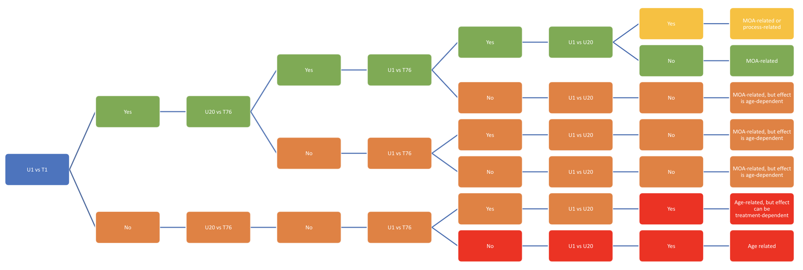

# Gene research
The Flen project

## Overview
The following decision tree represents the logic that determine the type of the gene based on the fold-change value and p value.<br />
Specifically, the gene is determined to be interesting if the fold-change $\geq$ 0.5 and p-value $\leq$ 0.05.

The tree represents those characteristics which is determined to be interesting, there are a few branches where there is a sub-branch for one condition but no branch for the other. Those sub-branches which are not listed on the tree are defined as "Inconclusive".



## How to use

### Requirement
- python 3.7 or later
- pandas

### Run
```
python main.py
```
The program will ask you to enter the "KEGG Gene ID" of the gene you want to check and return the type of gene based on the logic we defined on the decision tree.

## Acknowledgement
Should you have any question on this program, feel free to reach out at <tu.vv@joonsolutions.com>